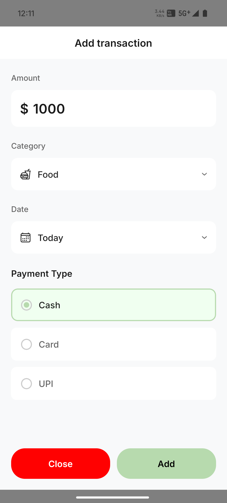

# 📱 Expense Tracker App

A simple yet powerful **React Native Expense Tracker** that helps users keep track of their daily expenses with a clean and intuitive UI. The app supports adding, viewing, and visualizing expenses, and stores data locally using `AsyncStorage`.

---

## 🚀 Features

* ➕ **Add Expense**: Input amount, category, date, and payment type
* 📋 **View Expenses**: Scrollable list of recent transactions
* 📊 **Income vs Spent Chart**: Doughnut chart visualization using `react-native-pie-chart`
* 💾 **Local Storage**: Persistent data using `AsyncStorage`
* 💡 **Minimal UI**: Clean and modern design for better user experience
* 📱 **Optimized for 64-bit**: Builds only for 64-bit devices

---

## 📷 Screenshots

| Home Screen                   | Add Expense                 |
| ----------------------------- | --------------------------- |
|  |  |

---

## 🛠️ Tech Stack

* [React Native](https://reactnative.dev/)
* [TypeScript](https://www.typescriptlang.org/)
* [AsyncStorage](https://react-native-async-storage.github.io/async-storage/)
* [react-native-pie-chart](https://www.npmjs.com/package/react-native-pie-chart)
* [react-native-vector-icons](https://github.com/oblador/react-native-vector-icons)

---

## 📦 Installation

```bash
git clone https://github.com/your-username/expense-tracker-app.git
cd expense-tracker-app
npm install
npx pod-install
```

---

## ▶️ Run the App

### Android

```bash
npx react-native run-android
```

### iOS (Mac only)

```bash
npx react-native run-ios
```

---

## 🧪 Build APK (64-bit only)

```bash
cd android
./gradlew clean
./gradlew assembleRelease
```

Output APK: `android/app/build/outputs/apk/release/app-release.apk`

---

## 📁 Project Structure

```
/expense-tracker-app
├── /android
├── /ios
├── /src
|   ├── /components
|   |   ├── AddTransactionModal.tsx
|   |   ├── PaymentTypeOption.tsx
|   |   ├── TabButton.tsx
|   |   ├── TransactionItem.tsx
|   |   └── TransactionModal.tsx
|   ├── /screens
|   │   ├── HomeScreen.tsx
|   │   └── WelcomeScreen.tsx
|   ├── /utils
|   │   ├── getEmoji.tsx
|   │   └── helperFunctions.tsx
|   ├── App.tsx
└── README.md
```

---

## 🙌 Acknowledgements

* Icons by [Feather Icons](https://feathericons.com) and [Ionicons](https://ionic.io/ionicons)
* Inspired by many open-source finance apps and UI kits

---

## 👤 Author

**Shubhendu Maharana**
MCA Student @ Odisha University of Technology and Research
[LinkedIn](https://www.linkedin.com/in/shubhendu-maharana) | [GitHub](https://github.com/Shubhendu-Maharana)

---

> Feel free to contribute or suggest improvements!
